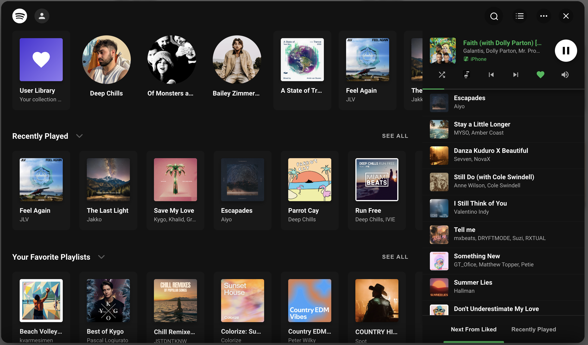
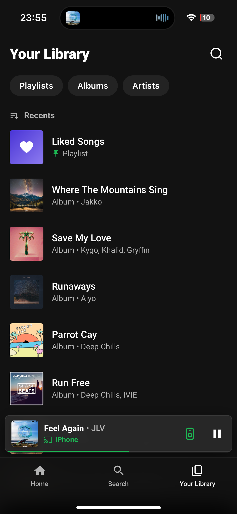
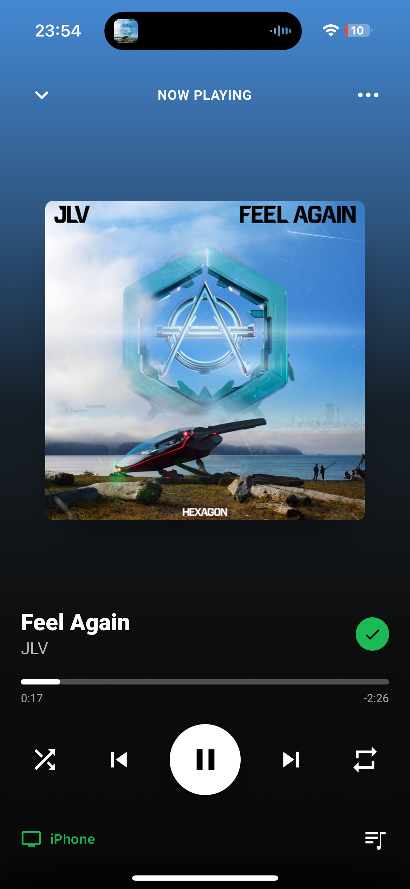

# Spotify Browser Card

A full-screen Spotify browser for Home Assistant dashboards. Browse your library, search, manage playlists, control playback and devices — styled after the Spotify app on both desktop and mobile.

> [!IMPORTANT]
> Requires the [SpotifyPlus](https://github.com/thlucas1/homeassistantcomponent_spotifyplus) integration. Use **v1.0.200 or newer** for playlist management.

## Preview

### Desktop
<p align="center">
  
  
</p>
<p align="center">
  
  
</p>

### Mobile
<p align="center">
  
  
  
  
</p>

## 1. Install

### HACS (recommended)

1. Open **HACS** in Home Assistant.
2. Menu (⋮) → **Custom repositories**.
3. Add `https://github.com/BWilky/HA-Spotify-Browser`, category **Lovelace**.
4. Install **Spotify Browser**. HACS registers the dashboard resource for you.

### Manual

1. Download `spotify-browser.js` from the [latest release](https://github.com/BWilky/HA-Spotify-Browser/releases).
2. Copy it to your Home Assistant `www/` folder.
3. Add the resource to your dashboard:

```yaml
resources:
  - url: /local/spotify-browser.js
    type: module
```

## 2. Get it running

Add the card to any dashboard view:

```yaml
type: custom:spotify-browser-card
entity: media_player.spotifyplus_yourname
```

That's the whole minimal config. The card renders a launch button; tap it and the browser opens.

You can also configure it once at the dashboard root instead of placing a card (dashboard menu → Raw configuration editor):

```yaml
spotify_browser:
  entity: media_player.spotifyplus_yourname
```

## 3. Launch the browser

Besides the card button, anything that navigates to a URL hash opens it — a dashboard button, a picture element, an automation:

* `#spotify-browser` — open the browser
* `#spotify-browser-now-playing` — open straight to Now Playing (mobile)
* `#user-a` — open and switch to that account (from `accounts[].hash`)

Example with a button card:

```yaml
type: button
icon: mdi:spotify
tap_action:
  action: navigate
  navigation_path: "#spotify-browser"
```

Or from JavaScript:

```javascript
window.dispatchEvent(new CustomEvent('spotify-browser-open'));
window.dispatchEvent(new CustomEvent('spotify-browser-open-now-playing'));
```

## 4. Storage setup (pinning and device settings)

Pinned home items and device settings persist in a template sensor. Without it the card still works — you just can't pin items or save device settings.

### Sensor — add to `configuration.yaml`

```yaml
template:
  - trigger:
      - platform: event
        event_type: spotify_browser_store_data
    sensor:
      - name: Spotify Browser Data
        unique_id: spotify_browser_data
        state: "{{ now().timestamp() | int }}"
        attributes:
          data: "{{ trigger.event.data.data }}"
```

### Helper script — add to `scripts.yaml` (needed for non-admin users)

Admin users write to the sensor directly. Non-admin users (guest accounts, wall tablets, family phones) can't fire events in HA — this script fires it for them:

```yaml
spotify_browser_store:
  alias: Spotify Browser Store
  mode: queued
  fields:
    data:
      description: Full data object to persist
  sequence:
    - condition: template
      value_template: "{{ data is mapping }}"
    - event: spotify_browser_store_data
      event_data:
        data: "{{ data }}"
```

### Point the card at them

```yaml
storage:
  sensor: sensor.spotify_browser_data
  event: spotify_browser_store_data
  script: spotify_browser_store
```

These are the defaults, so if you use the names above you only need `storage.script` — and only if non-admin users will pin things. Restart HA (or reload template entities and scripts), then enable pinning with `home: {pinned: true}`.

## Sonos

Sonos speakers are "restricted" Spotify Connect devices: their playback and queue live on the speaker itself, not in the Spotify API. Controlled the normal way, they sit idle or lag behind.

The card ships a Sonos bridge for this. When playback is on a Sonos speaker, the bridge routes everything through the [HA Sonos integration](https://www.home-assistant.io/integrations/sonos/) instead of the Spotify cloud: now-playing state is read from the Sonos entity, transport and volume commands go straight to it, playlist/album launches load the speaker's own queue, and grouped speakers are controlled through their group coordinator. SpotifyPlus stays in use for browsing and as the fallback when the bridge can't handle something.

Turn it on:

```yaml
sonos: true
```

Options:

* `prefer_sonos` — trust the Sonos entity's own state first (default `false`). Recommended when a Sonos speaker is your main player, since local Sonos playback is invisible to the Spotify API.
* `launch_mode` — `local` (default): the bridge drives the Sonos entity directly for launches; `spotifyplus`: launches route through SpotifyPlus (best when its Web Player token auth is set up).
* `device_map` — usually not needed (speakers auto-match by name). Entries of `{spotify: "Living Room", entity: media_player.living_room}` fix a wrong match.
* `debug` — log `[Sonos]` routing decisions to the console.

Notes: use SpotifyPlus v1.0.95+; the Spotify account must be linked in the Sonos app; avoid controlling the same speaker from the Sonos app while the card is driving it.

---

# Advanced configuration

Works at the card level or under `spotify_browser:` at the dashboard root.

Every option group follows one shorthand rule:
* omitted → defaults
* `true` → enabled with defaults
* `false` → disabled
* scalar/list → the group's main value (e.g. `auto_close: 300`, `volume: 25`)
* object → your keys merged over the defaults

Unknown or renamed keys log a one-time console warning with a hint.

| Key | Type | Description |
| :--- | :--- | :--- |
| `entity` | string | The SpotifyPlus `media_player` entity. Required unless `accounts` is set. |
| `accounts` | list | Multiple accounts: `entity`, `name`, `image`, `hash`, `default`. |
| `browser` | object | Trigger `hash`, `auto_close`, `home_on_exit`, `cache_size`, `debug`. |
| `appearance` | object | `performance`, `animations`, desktop window sizing. |
| `home` | object | Section `sort`, `pinned` toggle, `made_for_you` content. |
| `devices` | object | Default device, picker `icons`, `volume` rules. |
| `queue` | object | Desktop queue sidebar and mini-player buttons. |
| `sonos` | object / bool | Sonos speaker support. Off by default. |
| `storage` | object | Persistence: `sensor`, `event`, `script`. |
| `integrations` | object | `lastfm.api_key` for "Fans also like" on artist pages. |

### browser
* `hash` — URL hash that opens the browser (default `spotify-browser`).
* `auto_close` — close after N seconds without interaction. `0`/omitted disables. Useful for wall tablets.
* `home_on_exit` — `true` (default) resets to Home on close; `false` remembers the last page; a number remembers it for N seconds.
* `cache_size` — pages kept in history (default `10`).
* `debug` — verbose console logging.

### appearance
* `performance` — `auto` (default), `high`, or `low` (no blur, less motion). Set `low` explicitly for slow tablets — `auto` can't always detect them.
* `animations` — `false` turns everything off, or set `page_transition` (`fade`/`slide`/`none`), `browser_open`, `blur`.
* `desktop` — window sizing on desktop: `mode` (`default`/`fixed`/`fullscreen`), `width`, `height`, `margin` (or per-side `margin_top` etc.).

### home
* `sort` — section order. Tokens: `pinned`, `recently_played`, `made_for_you`, `favourite_playlists`, `followed_artists`, `favourite_albums`. Omitted sections are hidden.
* `pinned` — enable pinned items (default `false`). Needs the storage sensor.
* `made_for_you` — list of playlists/albums to feature, or `{content: [...], pills: true}`.

### devices
* `default` — device ID marked with a ★ in the picker.
* `icons` — list of `{name: "Kitchen Speaker", icon: "mdi:speaker"}` (match by `name` or `id`; `icon` takes `mdi:` names or image URLs).
* `volume` — a number sets the default level, or an object: `fallback`, `rules` (list of `{start: 'HH:MM', end: 'HH:MM', level: N}`), `rate_control`, `optimistic`.

Phones and some other devices refuse remote volume control (a Spotify limitation). The card detects this and shows "Volume is controlled on the device" instead of a broken slider.

### queue
* `open_on_desktop` — open the queue sidebar automatically on desktop (default `false`).
* `miniplayer` — mini-player row in the sidebar. `false` hides it, or set individual buttons: `shuffle`, `previous`, `next`, `like`, `volume`, `device`.

### sonos
See [Sonos](#sonos). Keys: `enabled` (or `sonos: true` shorthand), `prefer_sonos`, `launch_mode`, `device_map`, `debug`.

### storage
* `sensor` — the template sensor (default `sensor.spotify_browser_data`).
* `event` — the event it listens for (default `spotify_browser_store_data`).
* `script` — the helper script for non-admin write access.

See [Storage setup](#4-storage-setup-pinning-and-device-settings).

### integrations
* `lastfm.api_key` — enables "Fans also like" on artist pages.

## Multi-account

```yaml
accounts:
  - name: "User A"
    entity: media_player.spotifyplus_user_a
    default: true
    hash: "#user-a"
  - name: "User B"
    entity: media_player.spotifyplus_user_b
    hash: "#user-b"
```

Switch accounts from the avatar in the header, or link straight to one with its hash.

## Typeface (optional)

The card is designed around Spotify's Circular Std typeface. The font is commercially licensed, so it isn't bundled — the card falls back to your system font and everything still works.

If you own the family, put these four files in `/config/www/spotify-browser-fonts/`:

```
CircularStd-Book.woff2      # weight 400
CircularStd-Medium.woff2    # weight 500
CircularStd-Bold.woff2      # weight 700
CircularStd-Black.woff2     # weight 900
```

The card picks them up automatically. Missing files fall back silently.

## Full example

```yaml
type: custom:spotify-browser-card

accounts:
  - name: "Bryce"
    entity: media_player.spotifyplus_bryce
    default: true
    hash: "#bryce"
    image: "/local/spotify/bryce.jpg"
  - name: "Alice"
    entity: media_player.spotifyplus_alice
    hash: "#alice"

browser:
  hash: spotify-browser
  auto_close: 0          # seconds idle before closing; 0 disables
  home_on_exit: 300      # remember the last page for 5 minutes
  cache_size: 15
  debug: false

appearance:
  performance: auto      # auto | high | low
  animations:
    page_transition: fade # fade | slide | none
    browser_open: fade
    blur: true
  desktop:
    mode: fixed
    width: 1000px
    height: 700px
    margin: 32px

home:
  sort:
    - pinned
    - recently_played
    - made_for_you
    - favourite_playlists
    - followed_artists
    - favourite_albums
  pinned: true
  made_for_you:
    content:
      - id: "37i9dQZF1DXcBWIGoYBM5M"
        title: "Top Hits"
        type: "playlist"
    pills: true

devices:
  default: "speaker_kitchen"
  icons:
    - name: "Kitchen Speaker"
      icon: mdi:speaker
  volume:
    fallback: 25
    rules:
      - start: '09:00'
        end: '17:00'
        level: 35
      - start: '22:00'
        end: '07:00'
        level: 15
    rate_control: true
    optimistic: true

queue:
  open_on_desktop: true
  miniplayer: true       # or per-button: {shuffle, previous, next, like, volume, device}

sonos:
  enabled: true
  prefer_sonos: true
  launch_mode: local
  device_map:
    - spotify: "Dining Room"
      entity: media_player.dining_room

storage:
  sensor: sensor.spotify_browser_data
  event: spotify_browser_store_data
  script: spotify_browser_store

integrations:
  lastfm:
    api_key: "YOUR_LASTFM_API_KEY"
```

A commented copy of this lives in [`full_example_config.yaml`](full_example_config.yaml).

## Migrating from v1

The v2 schema has no legacy aliases — old keys are ignored with a console warning. Every v1 key maps as follows:

| v1 key (and aliases) | v2 |
| :--- | :--- |
| `entity` / `entity_id` | `entity` |
| `spotify_accounts` (item `picture`) | `accounts` (item `image`) |
| `custom_hash` | `browser.hash` |
| `auto_close` / `autoclose` / `auto_close_seconds` | `browser.auto_close` |
| `homeonexit` / `home_on_exit` | `browser.home_on_exit` |
| `cache_size` | `browser.cache_size` |
| `debug` | `browser.debug` |
| `closeondisconnect` / `close_on_disconnect` | **removed** (was never functional) |
| `performance` / `perf` (`full`/`max` → `high`, `lite` → `low`) | `appearance.performance` |
| `animations.*` | `appearance.animations.*` |
| `desktop_style.*` | `appearance.desktop.*` |
| `homescreen.sort` (`recently played` token) / `home_order` | `home.sort` (`recently_played`) |
| `homescreen.sticky.helper` / `homescreen.pinned_items_entity` | `home.pinned: true` (helper entity obsolete — pins live in `storage.sensor`) |
| `homescreen.madeforyou` (`items`, `desktop_pills`) / root `madeforyou` / `desktop_madeforyou_pills` | `home.made_for_you` (`content`, `pills`) |
| `homescreen.cache` / `homescreen.expiry` | **removed** (was never functional) |
| `homescreen.customize` / `custimize` | **removed** (dead feature) |
| `device_playback.helper` / `device_manager` | **removed** (device settings live in `storage.sensor`) |
| `device_playback.hide` | **removed** (was never functional — hide devices via the in-app device manager) |
| `device_playback.show` | `devices.icons` (it only ever set icons) |
| `device_playback.default` / `default_device` | `devices.default` |
| `volume.default` (scalar) / `device_playback.default_volume` | `devices.volume` (scalar) |
| `volume.default.fallback` / `.rules` | `devices.volume.fallback` / `.rules` |
| `volume.slider.rate_control` / `.optimistic` | `devices.volume.rate_control` / `.optimistic` |
| `queue` (list form) | `queue` (object only) |
| `queue.desktop.open_init` | `queue.open_on_desktop` |
| `queue.desktop.miniplayer` | `queue.miniplayer` (object now **merges over defaults**; v1 treated unset buttons as off) |
| `sonos.*` (`device_map[].device`) | unchanged (`device_map[].spotify`) |
| `storage.sensor_entity` / `sensorentity` / `sensor` / root `storage_sensor` | `storage.sensor` |
| `storage.event_type` / `eventtype` / `event` / root `storage_event` | `storage.event` |
| `storage.write_script` / `writescript` / `script` / root `storage_script` | `storage.script` |
| `advanced.similar_artists` | **removed** (was never functional — a Last.fm key alone enables it) |
| `external_providers.lastfm.api_key` | `integrations.lastfm.api_key` |
